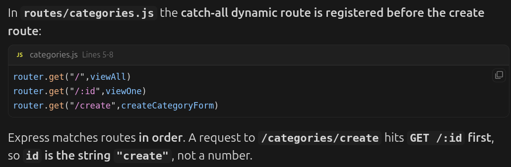

# What this project actually is

A CRUD application with:

- A database with RELATED tables (not just one table)
- Full Create, Read, Update, Delete for EVERYTHING
- A real folder structure used in professional projects
- Deployed and accessible on the internet

# The Core Concept: Related Tables

categories table items table
───────────────── ──────────────────────────────
id | name id | name | price | category_id
1 | Electronics 1 | Phone | 999 | 1
2 | Clothing 2 | Shirt | 29 | 2
3 | Laptop| 1299 | 1
↑
this links to categories.id

# A Tea Shop Inventory

Has natural categories (Green Tea, Black Tea, Herbal Tea, Equipment)
Has natural item properties (name, description, price, stock quantity, origin)

HOME PAGE
→ Shows all categories as cards
→ Click a category to see its items

CATEGORIES
→ View all categories GET /categories
→ View one category + items GET /categories/:id
→ Create category form GET /categories/create
→ Handle create POST /categories/create
→ Edit category form GET /categories/:id/edit
→ Handle edit POST /categories/:id/edit
→ Delete category POST /categories/:id/delete

ITEMS
→ View all items GET /items
→ View one item GET /items/:id
→ Create item form GET /items/create
→ Handle create POST /items/create
→ Edit item form GET /items/:id/edit
→ Handle edit POST /items/:id/edit
→ Delete item POST /items/:id/delete

# Database Tables

categories
──────────────────────────────
id SERIAL PRIMARY KEY
name VARCHAR(100) NOT NULL
description TEXT

items
──────────────────────────────────────
id SERIAL PRIMARY KEY
name VARCHAR(100) NOT NULL
description TEXT
price DECIMAL(10, 2) NOT NULL
stock INTEGER NOT NULL DEFAULT 0
origin VARCHAR(100)
category_id INTEGER REFERENCES categories(id)

# The Delete Decision:

If you delete a category:
→ All items in that category get their
category_id set to NULL
(they become "uncategorized" items)
→ This is called ON DELETE SET NULL in SQL
→ Better than deleting all items accidentally

If you delete an item:
→ Just delete it, nothing else is affected

\*\* UPDATE items SET category_id = NULL WHERE category_id=1;

\*\* For SET NULL to work, your category_id must not have a NOT NULL constraint

# Folder Structure

tea-shop-inventory/
├── controllers/
│ ├── categoryController.js ← all category logic
│ └── itemController.js ← all item logic
├── db/
│ ├── pool.js ← database connection
│ ├── queries.js ← all SQL query functions
│ └── populatedb.js ← seed script
├── routes/
│ ├── index.js ← home route
│ ├── categories.js ← category routes
│ └── items.js ← item routes
├── views/
│ ├── partials/
│ │ ├── header.ejs
│ │ └── footer.ejs
│ ├── index.ejs
│ ├── categories/
│ │ ├── index.ejs ← all categories
│ │ ├── detail.ejs ← one category + its items
│ │ └── form.ejs ← create AND edit (reused)
│ └── items/
│ ├── index.ejs ← all items
│ ├── detail.ejs ← one item
│ └── form.ejs ← create AND edit (reused)
├── public/
│ ├── css/
│ │ └── output.css ← tailwind compiled output
│ └── images/
├── app.js
├── .env
├── .env.example
├── .gitignore
├── package.json
├── tailwind.config.js
└── input.css ← tailwind source file

# New Concepts: Controllers

routes/categories.js
router.get("/", categoryController.getAll);
// route file just says WHICH controller handles it
// clean and short

controllers/categoryController.js
exports.getAll = async (req, res) => {
// ALL the logic lives here
// organized by feature
};

# Basic Express Validator pattern

In your controller:

1. Define validation rules
2. Run them
3. Check if there are errors
4. If errors: re-render form with errors and old input
5. If clean: save to database and redirect

# Real implementation of express validator - controllers/categoryController.js

// controllers/categoryController.js

const db = require("../db/queries");

// Import these two things from express-validator
// body → validates req.body fields (form inputs)
// validationResult → collects all the errors after checking
const { body, validationResult } = require("express-validator");

// ─────────────────────────────────────────────────────
// VALIDATION RULES
// Define once, reuse for both CREATE and EDIT
// This is an array of rules
// ─────────────────────────────────────────────────────
const categoryValidationRules = [
// body("name") means: look at req.body.name
body("name")
.trim()
// .notEmpty() fails if the value is "" after trimming
.notEmpty()
.withMessage("Category name is required.")
// .isLength() checks the string length
.isLength({ max: 100 })
.withMessage("Category name must be under 100 characters."),

body("description")
.trim()
// .optional() means: if this field is empty, skip other rules
// useful for fields that are not required
.optional({ values: "falsy" })
.isLength({ max: 500 })
.withMessage("Description must be under 500 characters.")
];

// ─────────────────────────────────────────────────────
// GET /categories
// Show all categories
// ─────────────────────────────────────────────────────
const getAllCategories = async (req, res) => {
const categories = await db.getAllCategories();
res.render("categories/index", {
title: "All Categories",
categories
});
};

// ─────────────────────────────────────────────────────
// GET /categories/:id
// Show one category and its items
// ─────────────────────────────────────────────────────
const getCategoryDetail = async (req, res) => {
const { id } = req.params;
const category = await db.getCategoryById(id);

if (!category) {
return res.status(404).render("notFound", { title: "Not Found" });
}

const items = await db.getItemsByCategory(id);

res.render("categories/detail", {
title: category.name,
category,
items
});
};

// ─────────────────────────────────────────────────────
// GET /categories/create
// Show the create form
// ─────────────────────────────────────────────────────
const getCreateForm = (req, res) => {
res.render("categories/form", {
title: "Add Category",
// errors is empty on first visit
errors: [],
// formData is empty on first visit
// EJS uses this to repopulate inputs after errors
formData: {}
});
};

// ─────────────────────────────────────────────────────
// POST /categories/create
// Handle create form submission
//
// Notice: categoryValidationRules is exported separately
// The route file will use it as middleware BEFORE this runs
// ─────────────────────────────────────────────────────
const postCreateForm = async (req, res) => {
// STEP 1: Collect validation results
// validationResult(req) reads all the errors that
// the validation middleware found
const errors = validationResult(req);

// STEP 2: Check if there are errors
if (!errors.isEmpty()) {
// errors.isEmpty() returns true if NO errors
// so !errors.isEmpty() means "there ARE errors"

    return res.render("categories/form", {
      title: "Add Category",
      // errors.array() converts errors to a plain array:
      // [
      //   { path: "name", msg: "Category name is required." },
      //   { path: "description", msg: "..." }
      // ]
      errors: errors.array(),
      // Send their input back so they don't retype
      formData: req.body
    });

}

// STEP 3: No errors - safe to save
await db.createCategory({
name: req.body.name.trim(),
description: req.body.description ? req.body.description.trim() : ""
});

res.redirect("/categories");
};

// ─────────────────────────────────────────────────────
// GET /categories/:id/edit
// Show the edit form prefilled with existing data
// ─────────────────────────────────────────────────────
const getEditForm = async (req, res) => {
const { id } = req.params;
const category = await db.getCategoryById(id);

if (!category) {
return res.status(404).render("notFound", { title: "Not Found" });
}

res.render("categories/form", {
title: "Edit Category",
errors: [],
// Pass existing data so form is pre-filled
formData: category
});
};

// ─────────────────────────────────────────────────────
// POST /categories/:id/edit
// Handle edit form submission
// ─────────────────────────────────────────────────────
const postEditForm = async (req, res) => {
const { id } = req.params;
const errors = validationResult(req);

if (!errors.isEmpty()) {
return res.render("categories/form", {
title: "Edit Category",
errors: errors.array(),
formData: req.body
});
}

await db.updateCategory(id, {
name: req.body.name.trim(),
description: req.body.description ? req.body.description.trim() : ""
});

res.redirect(`/categories/${id}`);
};

// ─────────────────────────────────────────────────────
// POST /categories/:id/delete
// Delete a category
// ─────────────────────────────────────────────────────
const deleteCategory = async (req, res) => {
const { id } = req.params;
await db.deleteCategory(id);
res.redirect("/categories");
};

// Export everything
module.exports = {
categoryValidationRules,
getAllCategories,
getCategoryDetail,
getCreateForm,
postCreateForm,
getEditForm,
postEditForm,
deleteCategory
};

# routes/categories.js - How validation plugs in

// routes/categories.js

const express = require("express");
const router = express.Router();

const {
categoryValidationRules,
getAllCategories,
getCategoryDetail,
getCreateForm,
postCreateForm,
getEditForm,
postEditForm,
deleteCategory
} = require("../controllers/categoryController");

// READ
router.get("/", getAllCategories);
router.get("/create", getCreateForm);
router.get("/:id", getCategoryDetail);
router.get("/:id/edit", getEditForm);

// WRITE
// Notice categoryValidationRules is in the MIDDLE
// It runs BEFORE postCreateForm
// This is Express middleware chaining
//
// Request flow:
// POST /create
// → categoryValidationRules runs (checks all rules, attaches errors to req)
// → postCreateForm runs (reads those errors with validationResult(req))
router.post("/create", categoryValidationRules, postCreateForm);
router.post("/:id/edit", categoryValidationRules, postEditForm);
router.post("/:id/delete", deleteCategory);

module.exports = router;

# How display errors in EJS - views/categories/form.ejs

<%- include('../partials/header') %>

  <h1 class="text-2xl font-bold text-amber-900 mb-6">
    <%= title %>
  </h1>

<%-- ERROR BOX - only shows if there are errors --%>
<% if (errors.length > 0) { %>

Please fix the following:

<ul class="list-disc list-inside space-y-1">
<% errors.forEach(function(error) { %>
<li class="text-red-600 text-sm">
<%- error.msg %>
<%-- error.msg is the .withMessage() text you wrote --%>
</li>
<% }) %>
</ul>

<% } %>

  <form
    action="<%= formData.id ? `/categories/${formData.id}/edit` : '/categories/create' %>"
    method="POST"
    class="bg-white rounded-xl shadow-sm border border-gray-200 p-6 space-y-5"
  >
    <%-- NAME FIELD --%>
    

      <label
        for="name"
        class="block text-sm font-medium text-gray-700 mb-1"
      >
        Category Name *
      </label>
      <input
        type="text"
        id="name"
        name="name"
        value="<%= formData.name || '' %>"
        placeholder="e.g. Green Tea"
        class="w-full px-3 py-2 border border-gray-300 rounded-lg focus:outline-none focus:ring-2 focus:ring-amber-500 focus:border-transparent"
      >
    

    <%-- DESCRIPTION FIELD --%>
    

      <label
        for="description"
        class="block text-sm font-medium text-gray-700 mb-1"
      >
        Description
      </label>
      <textarea
        id="description"
        name="description"
        rows="4"
        placeholder="Describe this category..."
        class="w-full px-3 py-2 border border-gray-300 rounded-lg focus:outline-none focus:ring-2 focus:ring-amber-500 focus:border-transparent resize-none"
      ><%= formData.description || '' %></textarea>
    

    <%-- BUTTONS --%>
    

      <a
        href="/categories"
        class="px-4 py-2 border border-gray-300 rounded-lg text-gray-600 hover:bg-gray-50 transition"
      >
        Cancel
      </a>
      <button
        type="submit"
        class="px-6 py-2 bg-amber-700 text-white rounded-lg hover:bg-amber-800 transition font-medium"
      >
        <%= formData.id ? 'Save Changes' : 'Add Category' %>
      </button>
    

  </form>

<%- include('../partials/footer') %>

# All validator methods you will use

body("fieldName")
.trim() // remove whitespace first
.notEmpty() // must not be empty
.withMessage("custom message") // message for the rule above
.isLength({ min: 2, max: 100 }) // string length
.isFloat({ min: 0 }) // decimal number
.isInt({ min: 0 }) // whole number
.isEmail() // valid email format
.optional({ values: "falsy" }) // skip rules if field is empty
.custom((value) => { // write your own rule
if (someCondition) {
throw new Error("custom error message");
}
return true;
})

# Don't miss 'await' in Controllers

# Mind the routes order

# <% vs <%= in EJS

<% %> Runs JS only. Its results is not inserted into the HTML. (Computed but never shown)
<%= > Runs an expression and prints the result into the template (HTML escaped by default). Use it when you want output: text, attributes, selected, etc

# Error handling:

Rule: any function that uses req.params.id needs BOTH guards
any function that touches the database needs try/catch

1. Guard against non-numeric ids like categories/abc
2. Guard against id that does not exist in database

# try/catch for database calls

Add a global error handler in app.js:
app.use((err,req,res,next)=>{
console.error(err.stack)
res.status(500).render("error",{
title:"Server Error",
message:"Something went wrong. Please try again"
})
})

Then in controllers use try/catch with next:
const viewAll =async (req,res,next)=>{
try{
const categories=await db.getAllCategories();
res.render("categories/index",{title:"All categories",categories})
}catch(err){
next(err); //passes error to the global handler above
}
}
